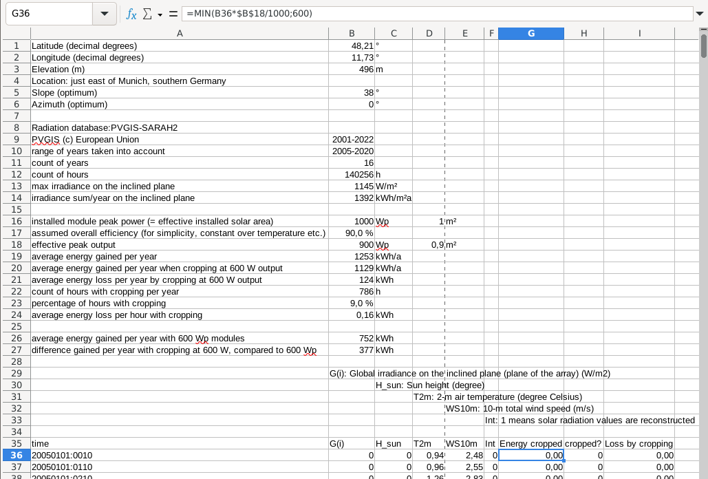

== Kleine Solaranlagen für zu Hause und fürs Campen

=== Zusammenfassung

Mit sog. Balkonkraftwerken kann man relativ einfach und günstig
Solarstrom gewinnen und über eine Steckdose ins Hausnetz einspeisen.
Das spart Stromkosten und rechnet sich nach mehreren Jahren Betrieb,
allerdings nur soweit man den Strom auch gleichzeitig selbst verbraucht.

Für eine gewisse Unabhängigkeit vom allgemeinen Stromnetz und von der nicht
immer kräftig vorhandenen Sonneneinstrahlung braucht man sog. Inselanlagen.
Diese benötigen zusätzlich aufladbare Batterien als Stromspeicher
sowie andere Wechselrichter und Solarladeregler als Stecker-Solaranlagen,
was sie aufwendiger und deutlich teurer macht.

=== Möglicher Energie-Ertrag

Mit Solarzellen kann man Sonnenlicht in elektrische Energie umwandeln,
wenn auch leider nicht gerade effizient.
Der https://de.wikipedia.org/wiki/Solarzelle#Wirkungsgrad[Wirkungsgrad]
der heutzutage üblichen Photovoltaik-Technologie mit Siliziumzellen
liegt typischerweise bei nur etwa 18 bis 20%.
Außerdem gibt es Verluste, wenn die Solarmodule nicht senkrecht zur Einstrahlung
ausgerichtet, (teil-)verschattet, verschmutzt oder zu warm sind.
Zu berücksichtigen ist zudem der Wirkungsgrad der übrigen PV-Anlage
von etwa 80 bis 95%.

// https://www.photovoltaiksolarstrom.com/wp-content/uploads/2012/03/globalstrahlung_deutschland.jpg
image:Globalstrahlung_Deutschland.jpg[%Bild: Globalstrahlung in Deutschland%,400,align=right]
Die maximale Einstrahlung auf die Erde mittags bei klarem Himmel in Bodennähe
auf eine Fläche senkrecht zum Sonnenstand liegt bei 1361 W/m^2^ und wird als
http://www.energieinfo.de/eglossar/sonneneinstrahlung[
terrestrische Solarkonstante] bezeichnet.
Natürlich ist die tatsächliche Sonneneinstrahlung im Durchschnitt viel geringer.
Sie hängt stark vom Standort auf der Erde ab
(siehe z.B. https://globalsolaratlas.info/map[Simulationswerte von Solargis])
und ist je nach Bewölkung, Tages- und Jahreszeit sehr variabel.

Die Nennleistung von Solarmodulen wird in Wp
(https://de.wikipedia.org/wiki/Watt_Peak[Watt Peak]) angegeben.
Zu ihrer Bestimmung verwendet man eine Referenzbestrahlung mit einem normierten
Sonnenlichtspektrum einer Stärke von 1000 W/m² bei einer Zelltemperatur von 25°C.
Bei näherer Betrachtung bedeutet die Nennleistung in kWp (also 1000 Wp) die
_effektive Solarfläche_ des Moduls, also dessen Fläche (in m²) × Wirkungsgrad.
Daher lässt sich der Wirkungsgrad eines Solarmoduls einfach berechnen,
indem man seine Nennleistung in kWp durch seine Fläche in m² teilt.

// https://www.energie-experten.org/fileadmin/System-Bilder/Inhalt_Bilder/Photovoltaik_Solarmodule_Leistung_Ausrichtung_Grafik_energie-experten.org.jpg
// https://i0.wp.com/machdeinenstrom.de/wp-content/uploads/2018/03/Azimut.png?w=855&ssl=1
image:Solarmodule_Ausrichtung2.webp[%Bild: Ausrichtung von Solarmodulen%,400,align=right]
Die Wp-Angaben von Herstellern und Händlern für Solarmodule sind mit Vorsicht
zu genießen -- hauptsächlich weil die tatsächliche Leistung wie oben erwähnt
stark von der Situation abhängig und meist deutlich geringer ist.
Außerdem weil besonders chinesische Händler von flexiblen Solarmodulem
dazu tendieren, bei den Leistungsangaben deutlich zu übertreiben.
Daher loht sich als Plausibiltäts-Check, den Wirkungsgrad nachzurechnen.

In unseren Breitengraden ist je nach Standort
bei optimaler statischer Ausrichtung von Solarmodulen
https://www.energie-experten.org/erneuerbare-energien/photovoltaik/planung/ertrag[
ein Ertrag von etwa 900 bis 1000 kWh pro kWp installierter PV-Nennleistung
und Jahr realistisch].
Der Jahresertrag lässt sich leicht näherungsweise berechnen durch Multiplikation
des standortspezifischen PV-Potentials (das bereits angenommene typische
System-Verlustfakturen beinhaltet) in kWh/kWp mit der PV-Nennleistung in kWp.
Das PV-Potential (PVOUT) kann man z.B. aus den kostenlosen
https://solargis.com/maps-and-gis-data/download[Karten von Solargis], aus dem
https://globalsolaratlas.info/map?c=50.10,11.05,7&s=48.1807,11.604e[
Global Solar Atlas der Weltbank] (auch von Solargis) oder aus der
https://re.jrc.ec.europa.eu/pvg_tools/de/[PVGIS-Datenbank der EU]
bei der Standard-Eingabe von 1 kWp für die installierte max. PV-Leistung.

Die https://machdeinenstrom.de/optimaler-ertrag-mit-mini-solar-kraftwerken/[
beste Ausbeute] bekommt man in süddeutschen Breitengraden bei Ausrichtung
genau nach Süden und mit ca. 38° Neigungswinkel (relativ zur Waagerechten).
Genaueres kann man z.B. über https://re.jrc.ec.europa.eu/pvg_tools/de/[PVGIS]
oder einfacher über
https://www.solarserver.de/pv-anlage-online-berechnen/[Solarserver]
standortspezifisch anhand von Geo- und Klimadaten berechnen/simulieren.

Wenn man Solarmodule (z.B. auf dem Dach eines Wohnmobils)
in waagerechter Lage anbringt, ist man zwar von der Himmelsrichtung unabhängig,
aber kommt nach meiner Erfahrung mit billigen flexiblen Modulen selbst mittags an
sehr sonnigen Tagen kaum über die Hälfte der angegebenen Spitzenleistung hinaus.

=== Nutzungsmöglichkeiten

Solarmodule liefern in direkter Abhängigkeit von der Einstrahlungsstärke
sehr variablen Gleichstrom (je nach Nennleistung maximal z.B. 10 A)
mit einer Spannung je nach Modultyp von üblicherweise 22 bis 44 V.
Dieser 'rohe' Strom ist direkt erst mal kaum verwendbar
(außer z.B. zum Aufheizen eines Warmwasserspeichers).

==== Stecker-Solaranlage ("Balkonkraftwerk" mit Netzeinspeisung)

// https://www.steckdosensolar.de/wp-content/uploads/2020/02/aufbau-balkonkraftwerk.jpg
image:Balkonkraftwerk.jpg[%Bild: Aufbau Balkonkraftwerk%,400,align=right]
Typischerweise speisen Solaranlagen den erzeugten Strom nach Umwandlung
durch einen netzgekoppelten Wechselrichter
(https://de.wikipedia.org/wiki/Solarwechselrichter[Solarwechselrichter],
engl. grid-tie inverter)
direkt ins (lokale oder öffentliche) Stromnetz ein, wo er sofort in
irgendeiner Form verbraucht wird (bzw. der Rest in Form von Wärme verlorengeht).
Zu beachten ist,
dass diese Nutzungsart abseits eines bestehenden Wechselstrom-Netzes und
während eines Stromausfalls (engl. blackout) nicht funktioniert, weil sich
hierfür verwendete Wechselrichter mit dem Stromnetz synchronisieren müssen.

Die auch
// https://www.energie-experten.org/erneuerbare-energien/solarenergie/solaranlage/balkonkraftwerk
'https://www.steckdosensolar.de/[Balkonkraftwerk]' genannten Anlagen
haben meist eine recht geringe Nennleistung von etwa 600-700 Wp.
Das hat neben der geringen Größe und sehr überschaubaren Kosten auch damit zu
tun, dass solche Anlagen selbst installiert werden dürfen und genehmigungsfrei
sind, wenn sie weniger als 600 W in die Steckdose einspeisen.
Diese Zahl gilt für Deutschland; anderswo sind 800 W (oder mehr) kein Problem.
Die nominale Leistung der verwendeten Solarmodule kann und sollte aber
durchaus größer sein (z.B. 800-1000 Wp), denn in der Praxis werden die 600 W
Ausgangsleistung kaum erreicht, vor Allem in sonnenarmen Zeiten,
zumal es Verluste nicht nur an den Modulen, sondern auch im Wechselrichter gibt.
Man hat durch einen gewisse "Überdimensionierung" auch zu ungünstigen Tages- und
Jahreszeiten entsprechend mehr Ausbeute (eigentlich sogar überproportional mehr,
weil die Schwellspannung schneller erreicht wird),
allerdings auf recht niedrigem absoluten Niveau.
Wenn der Solar-Wechselrichter die Ausgangsleistung auf 600 W begrenzt,
wird der Gesamtertrag durch die Kappung zwar verringert,
aber der Effekt ist nicht so groß, wie man meinen könnte.

Hier das Ergebnis einer Modellrechnung für den Raum München basierend auf
den https://re.jrc.ec.europa.eu/pvg_tools/de/#HR[stündlichen Daten des PVGIS]
für die Jahre 2005 - 2020 und
einem der Einfachheit halber als konstant angenommenen Gesamtverlust von 10%.
# während der u.A. den von PVGIS standardmäßig eingerechneten Systemverlust von 14% beinhaltet.
(Eigentlich müsste man die Verluste abhängig von Temperatur usw. simulieren,
aber die Vereinfachung macht im Verhältnis zu der genaueren Simulation von PVGIS
ohne Kappung nur einen relativen Fehler von ca. +/- 6% aus.) +
Ergebnis: Bei Verwendung von optimal statisch ausgerichteten 1000 Wp Modulen,
die eigentlich zu einem Ertrag von etwa 1253 kWh pro Jahr führen würden,
macht der Verlust durch Kappung auf 600 W Ausgangsleistung nur etwa 124 kWh aus.
Das erklärt sich damit, dass die Kappung realistisch bei nur knapp 9% der
(Gesamt-)Stunden stattfindet und der dadurch verursachte Verlust
im Schnitt nur etwa 0,16 kWh pro "gekappter" Stunde ausmacht.
Daher lohnt sich trotz Ausgangs-Begrenzung auf 600 W durchaus
eine größere Dimensionierung der Solarmodule auf z.B. 1000 Wp.

Von der gerade erzeugten Leistung fließt der Anteil, der nicht aktuell lokal
(also im Haushalt) durch Elektrogeräte verbraucht wird, automatisch ins externe
Stromnetz und wird praktisch an den jeweiligen Stromlieferanten verschenkt.
Die Zeiten, dass man durch einen rückwärts laufenden Stromzähler
'unter der Hand Strom verkaufen' konnte, sind vorbei,
und eine offiziell vergütete Einspeisung ist mit Extra-Aufwand verbunden
und bringt wenig -- sie beträgt in Deutschland gemäß eEG https://www.zolar.de/blog/entwicklung-der-eeg-einspeiseverguetung[zum 01.04.2022 nur noch 6,53 ct/kWh].
Hingegen spart man sich die Verbrauchskosten für den selbst erzeugten und gleichzeitig verbrauchten
Anteil, weil der Zähler für den aus dem externen Netz bezogenen Strom entsprechend langsamer läuft.
Übrigens ist es normalerweise egal, auf welcher Drehstrom-Phase (L1, L2 oder L3)
die Stecker-Solaranlage angeschlossen wird und
auf welcher Phase die gleichzeitig verwendeten Verbraucher angeschlossen sind
-- jedenfalls die neueren für die Abrechnung aktuell verwendeten Stromzähler
arbeiten saldierend (d.h. bilden die Gesamtsumme von Verbrauch und Einspeisung,
welche dabei negatives Vorzeichen hat).

Diese Nutzungsart lohnt sich also nur insoweit, wie man während der
Sonnenscheindauer den Strom sinnvoll verbrauchen kann, z.B. durch diverse
Haushaltsgeräte, Computer, Klimaanlagen oder zum Laden von Fahrzeug-Batterien.
Am einfachsten und am besten planbar ist es, wenn es ohnehin eine gewisse
relativ gleichmäßige Grundlast hat, z.B. durch Kühlschränke oder Wärmepumpen.
Je größer und tagsüber stromhungriger der Haushalt ist,
desto größer der zu erwartende Einsparungseffekt. +
Es gibt eine relativ einfache Nutzung von überflüssigem Strom,
die ich ziemlich clever finde,
nämlich zum (zusätzlichen) Aufheizen eines Warmwasserboilers im Haus,
so dass man weniger fossile Brennstoffe dafür verbraucht.

Wie eingangs geschrieben kann man bei optimaler Platzierung von Solarmodulen
pro Jahr bis zu etwa 1 kWh pro Wp installierter Solarleistung gewinnen.
Rechnet man beispielsweise mit einer Investition von über den Daumen 1€/Wp
(inklusive anteiligen Kosten für Wechselrichter etc., eher knapp kalkuliert)
zur Stromeinspeisung und einem damit eingesparten Arbeitspreis von 25 ct/kWh,
kommt man im Jahr auf 25 ct Ersparnis pro Wp,
so dass sich die Anlage in 4 Jahren amortisiert --
wohlgemerkt aber nur unter optimalen Bedingungen und der Annahme,
dass der damit erzeugte Strom komplett selbst verbraucht wird.
Wobei der Strompreis derzeit (Stand Oktober 2022) ja kräftig steigt --
bei Neuverträgen werden schon über 65 ct/kWh verlangt,
so dass die Rechnung damit noch wesentlich günstiger ausfällt:
Amortisierung bei 75% Eigenverbrauchsanteil in weniger als 2 Jahren.

==== Inselanlage mit Batteriespeicherung

// http://www.inselanlage.info/wp-content/uploads/2015/01/inselanlage-aufbau.jpg
image:Inselanlage.jpg[%Bild: Aufbau Inselanlage%,400,align=right]
Alternativ kann man den von den Solarmodulen gelieferten Strom auch in einer aufladbaren Batterie
(Akkumulator) speichern und bei Bedarf wieder abrufen.
Diese Betriebsart wird als 'http://www.inselanlage.info/[Inselanlage]' (engl. off-grid) bezeichnet
und ist für die Nutzung ohne externes Stromnetz (also z.B. bei Stromausfall, beim Campen mit dem
Wohnmobil oder Wohnwagen, auf Booten und für abseits gelegene Häuser oder Hütten) die einzig mögliche.

Neben der Speicherbatterie wird hier zumindest ein Solarladeregler benötigt,
und sofern die Verbraucher nicht direkt mit der Batteriespannung (z.B. 12 V Gleichstrom)
betrieben werden können, zusätzlich ein ausreichend leistungsstarker
Wechselrichter (manchmal auch 'Spannungswandler' genannt, engl. inverter)
zur Umwandlung in den üblichen 'Steckdosenstrom' (also Wechselstrom mit ca. 230 V).
Diese Nutzungsart ist flexibler, aber wegen der nötigen zusätzlichen Komponenten
deutlich teurer (und auch etwas anfälliger und wartungsintensiver).

==== Kombination aus Balkonkraftwerk und Inselanlage

Wenn man Zugang zum Stromnetz hat und die für beide Varianten nötigen Funktionen gleichzeitig
installiert sind, kann man zwischen diesen grundsätzlichen Nutzungsarten auch wechseln.
Dabei wird die Einspeisung die Solarmodule zwischen
dem netzgekoppelten Wechselrichter und dem Solar-Batterieladeregler
umgeschaltet (bzw. ohne Schalter einfach umgestöpselt).

=== Generelle Hinweise für die Auswahl von Komponenten

==== Solarmodule

Solarmodule (engl. solar panels) werden intern aus
vielen in Reihe gestalteten Solarzellen zusammengesetzt.
Als externen Stromanschluss habe sie meist MC4-Steckverbinder.
Wenige große Solarmodule sind technisch und wirtschaftlich etwas günstiger als
entsprechend viele kleine, besonders wenn man einen Regler pro Modul verwendet.

image:Kennlinie_Bestrahlungsstärke_Spannng-Strom.jpg[%Bild: Spannung und Strom abhängig von der Bestrahlungsstärke%,400,align=right]
// https://nils-isfh.de/solarzelle/
Bei den üblichen Silizium-Solarzellen steigt der entnehmbare Strom
(Kurzschlussstrom) linear mit der Bestrahlungsstärke.
Ihre Leerlaufspannung hingegen steigt schon bei geringer Helligkeit stark an
und nähert sich dann nur noch langsam steigend dem Wert 0,63 V.
Generell sind monokristalline Zellen zu bevorzugen, auch wenn sie ein wenig
teurer sind als polykristalline oder amorphe,
weil sie einen höheren Wirkungsgrad haben.

image:Starre_Solarpanels.jpg[%Bild: Starre Solarpanels%,400,align=left]
image:Flexible_Solarpanels.jpg[%Bild: Flexible Solarpanels%,400,align=right]
https://gruenes.haus/pv-modul-groesse-gewicht/[Klassische Solarmodule] haben
einen Aluminiumrahmen und eine Größe von typischerweise ca. 1,7 m × 1 m × 3 cm,
was eine Nennleistung von etwa 350 Wp ergibt, und eine Masse von ca. 20 kg.
(Semi-)Flexible Module sind teurer als starre und weniger langlebig,
dafür aber viel leichter und nur wenige Millimeter dick.
Sie sind meist auch deutlich kleiner -- typischerweise 1,2 m × 0,5 m
bei einer Nennleistung von 100 Wp und einer Masse von 1 bis 2 kg.
https://solar-generatoren.de/die-richtigen-solarmodule-fuers-wohnmobil/[Hier]
ein Vergleich verschiedener Solarmodul-Typen in Hinblick auf die Verwendung für
Wohnmobile.

image:Schindel-Solarmodul.jpg[%Bild: Schindel-Solarmodul%,400,align=right]
Technisch besonders interessant finde ich die überlappenden Anordnung und
direkte Verschaltung von Solarzellen ohne Stromschienen (engl. busbars) in
https://www.strom-forschung.de/aktuelles/news/2022/schindel-solarmodule-innovativ-verschaltet-und-industriell-herstellbar[Schindel-Modulen]
(engl. SSP = shingle solar panel).
Dadurch steigt der Wirkungsgrad, weil die Fläche besser genutzt wird
und bei Teilverschattung und Wärme die Verluste verringert werden.
Allerdings ist diese Bauart selten zu finden und verhältnismäßig teuer,
so dass sie nur dann sinnvoll ist, wenn man unbedingt etwas Platz sparen muss.

Solarmodule -- aber bitte nur gleichartige -- kann man wie Batteriezellen
seriell und/oder parallel verbinden, um mehr Leistung zu erhalten, ohne
für jedes Modul einen eigenen Regler (bzw. Regler-Eingang) verwenden zu müssen.
Für die parallele Verschaltung bieten sich MC4 Y-Steckverbindungen an.

* Bei https://de.wikipedia.org/wiki/Reihenschaltung[Reihenschaltung] (oft auch
'Serienschaltung' genannt) addieren sich die Spannungen der einzelnen Module,
wobei man unbedingt darauf achten muss, dass die maximale Eingangsspannung,
die der Regler verkraftet, nicht überschritten wird.
Ein Nachteil der Reihenschaltung ist, dass es dabei leichter zu
https://photovoltaikbuero.de/pv-know-how-blog/teilverschattung-bei-solarmodulen-messungen/[ Verlusten durch Teilverschattung] kommt,
denn die Leistung bricht ein, wenn auch nur eines der Module verschattet wird.

* Bei https://de.wikipedia.org/wiki/Parallelschaltung[Parallelschaltung]
addieren sich die Ströme der einzelnen Module,
wobei der je nach Einstrahlung mögliche Maximalstrom unter dem Maximalstrom
des Regler-Eingangs liegen sollte, weil sonst zumindest Leistung verschenkt wird.
Auch sind höhere Ströme, besonders bei dünnen Kabeln,
generell mit etwas mehr elektrischem Verlust verbunden.
Dafür hat man aber weniger Verluste durch Teilverschattung.

image:I-V-curves-of-the-solar-panel-under-different-irradiation-levels-and-the-Voltage.png[%Bild:
Strom-Spannungs-Kennlinien abhängig von der Bestrahlungsstärke%,400,align=right]
// https://www.researchgate.net/figure/I-V-curves-of-the-solar-panel-under-different-irradiation-levels-and-the-Voltage_fig33_327316174
Zu beachten ist noch, dass die Regler-Eingangsspannung je nach Modell bis zu 5 V
über der gewünschten Ausgangsspannung des Reglers (z.B. der Speicherbatterie)
liegen muss, damit der Regler effektiv Strom liefern kann.
Wenn man z.B. kleine Solarmodule mit 100 Wp und 22,6 V Leerlaufspannung hat,
wird es ohne Reihenschaltung
bei einer Ladeschlussspannung von ca. 14,5 V einer LiFePO4-Batterie
bei wolkigem Wetter (mit vielleicht nur 100 - 200 W/m^2^) ziemlich eng.

==== Spannungsregler, Solar-Laderegler und Wechselrichter

// image:I-U-Kennlinie_MPP_Silizium-Solarzelle.jpg[%Bild: I-U-Kennlinie_MPP_Silizium-Solarzelle%,400,align=right]
// https://nils-isfh.de/solarzelle/
image:Solar-Microinverter.png[%Bild: Solar-Microinverter%,400,align=right]
Für die Umwandlung des 'rohen' Solarstroms sind Spannungsregler mit
https://de.wikipedia.org/wiki/Maximum_Power_Point_Tracking[MPPT (Maximal-Leistungspunkt-Suche, engl. maximum power point tracking)]
zu empfehlen, weil sie auch bei stark wechselnder Einstrahlung optimale Energieausbeute bringen.
Sie sind allerdings deutlich teurer als die wesentlich einfacheren PWM-Regler.
Für die Koppelung mit dem Stromnetz werden Spannungsregler mit einem
integrierten Wechselrichter verwendet, die sich automatisch
an die Frequenz und Phase des anliegenden Wechselstroms anpassen
und bei fehlendem Stromanschluss den Ausgang abschalten -- auch aus
Sicherheitsgründen für den Fall, dass ein blanker Stecker berührt werden kann.

image:Solar-Laderegler.jpg[%Bild: Solar-Laderegler%,400,align=right]
Wenn man Solarmodule hingegen mit einer Batterie verbinden möchte, benötigt man einen
Solar-Laderegler, der einen Spannungsregler mit einem Batterieladegerät verbindet.
Mit billigen chinesischen (angeblich) MPPT-Reglern habe ich keine guten Erfahrungen gemacht,
wohl aber mit den europäischen Marken Victron und Votronic.

image:Wechselrichter.jpg[%Bild: Wechselrichter%,400,align=right]
Bei einem Wechselrichter sollte man darauf achten,
dass er ordentlichen Wechselstrom liefert (sog. 'reine Sinuswelle', engl. pure sine wave) sowie
einen hohen https://www.energie-experten.org/erneuerbare-energien/photovoltaik/wechselrichter/wirkungsgrad[Wirkungsgrad] (engl. efficiency) und einen
geringen Ruhe-/Leerlaufstromverbrauch (engl. standby power consumption) hat.
Außerdem ist empfehlenswert, ihn mit ausreichend Leistungsreserve zu
dimensionieren, auch weil er sonst schnell unangenehm lautes Lüftergeräusch
verbreiten und bei Dauerbelastung leichter Schaden nehmen kann.

image:Solar-off-grid-inverter.jpg[%Bild: Hybrides Solar-Ladegerät mit Wechselrichter%,400,align=right]
Es gibt auch https://www.solarserver.de/2021/07/26/green-cell-bietet-neuen-solarwechselrichter-an/[Kombigeräte],
welche die Funktionen Solar-Laderegler, Batterie-Netzladegerät und Wechselrichter in sich vereinen.
Damit können Elektrogeräte vorzugsweise direkt mit Solarstrom versorgt werden,
wobei die überschüssige Energie in einer Batterie gespeichert wird.
Bei unzureichender Stromversorgung aus den Solarmodulen
ergänzt das Gerät die benötigte Energie automatisch aus der Batterie
und schaltet bei leerer Batterie (oder je nach konfigurierter Präferenz
auch schon bei fehlendem Solarstrom) auf eine externe Stromquelle
(Stromnetz oder Generator) um, worüber auch die Batterie geladen wird.
Solch ein Kombigerät ist in seiner Funktionsweise sehr praktisch,
außerdem einfacher zu installieren und zu verwenden,
außerdem wirtschaftlicher als entsprechende Einzelkomponenten.
Es hat aber
https://www.oeko-energie.de/shop1/de/Solarstrom/Insel-WR/Kombigeraet-Laderegler-MPPT-Wechselrichter-Batterieladegeraet/[
auch Nachteile] wie geringe Flexibilität bei der Komponentenwahl. +
Und offenbar gibt es kein Gerät, das neben der Nutzungsart als Inselanlage
(also netzunabhängige Versorgung) auch den einer Stecker-Solaranlage
(also direkte Netzeinspeisung des Solarstroms) ermöglicht.

==== Speicherbatterien

image:LiFePO4-Batterie.jpg[%Bild: LiFePO4-Batterie mit 4 prismatischen Zellen%,400,align=right]
Für die Stromspeicherung bieten sich heutzutage Lithium-Eisenphosphat-Batterien (LiFePO4) an.
Diese sind zwar erheblich teurer als Blei-Säure-Batterien (inkl. der AGM-Variante),
wie man sie vom Auto kennt, aber sind nicht so schwer, viel spannungsstabiler
und vertragen ein Mehrfaches an Lade-/Entladezyklen.
Im Vergleich zu Li-Ionen- und Li-Polymer-Akkus, welche eine noch höhere Energiedichte haben,
sind sie recht robust und sicher.
Alle Lithium-basierten Batterien benötigen bei der Reihenschaltung von Akkuzellen ein sog.
Batteriemanagementsystem (BMS), das für eine gleichmäßige Spannungsverteilung der Zellen sorgt. +
Eine typische 100 Ah Autobatterie wiegt etwa 26 kg und kostet nur etwa 100€.
Aus ihrer Nennkapazität von 12 V × 100 Ah = 1200 Wh sollte man pro Entladung höchstens 50%
entnehmen, damit die Batterie nicht durch Tiefentladung Schaden nimmt, also maximal 600 Wh.
Selbst dann hält ein Bleiakku meist weniger als 1000 Lade-/Entladezyklen.
Die Zahl der Lade-/Entladezyklen eines Lithium-Eisenphosphat-Akkus liegt angeblich bei etwa 5000.
Eine 12,8 V 100 Ah LiFePO4-Batterie wiegt etwa 11 kg und kann zu 90% entladen werden,
ohne dass sie Schaden nimmt, so dass sich eine effektive Kapazität von 1150 Wh ergibt.
Unter Berücksichtigung der Wandlungsverluste eines Wechselrichters lässt sich damit ein Gerät
mit 1000 W Verbrauch (z.B. Staubsauger, Kaffeemaschine oder Fön) gut eine Stunde lang betreiben.

Um den Wandlungsverlust von ca. 10% eines Wechselrichters zu vermeiden,
sollte man bei einer Inselanlage die Verbraucher möglichst direkt an der Batterie anschließen,
was z.B. bei LED-Lampen, Radios und USB-Ladebuchsen gut machbar ist --
aber auch bei Laptops, wenn man für sie ein Netzteil mit 12 V (statt 230 V) Eingang verwendet.
Bei mittlerer Last von 25 W ergeben sich mit einer voll geladenen 12,8 V 100 Ah LiFePO4-Batterie
gut 50 Stunden Betriebszeit.
Ein durchschnittlicher 3,6 V Smartphone-Akku mit 2500 mAh hat 9 Wh Kapazität.
Wenn er jeweils zu 80% entladen wird, lässt er sich damit etwa 160 mal aufladen. +
Zum Vergleich: Eine Powerbank mit nominell 20.000 mAh Kapazität hat (aufgrund meist stark überzogener
Hersteller-Angaben und Verlusten bei der Wandlung von 3,6 V auf die 5 V eines USB-Anschlusses)
effektiv eher die Hälfte dieser Kapazität.
Ein durchschnittlicher Smartphone-Akku lässt sich über die Powerbank in der Praxis nur etwa 10 mal aufladen.

Der Preis einer Batterie pro kWh sinkt mit steigender Größe/Gesamtkapazität. +
// allerdings ist der Effekt eher gering. +
// Hier am Beispiel der o.g. Delong-LiFePO4-Akkus: Eine Batterie inkl. BMS
// ohne Versand kostet Stand Frühjahr 2022 mit 12,8 V 100 Ah etwa 215€,
// mit doppelter Kapazität etwa 410€,
// und mit 8-facher Kapazität (51,2 V, 200 Ah) etwa 1560€, also 10% günstiger.

image:What-are-Ohm-Amps-and-Volts.jpg[%Bild: Spannung, Strom und Widerstand%,400,align=right]
Wenn man die Wahl hat zwischen höherer Spannung (d.h. mehr Akkuzellen in Reihe)
oder größere bzw. mehr Zellen parallel, dann besser die höhere Spannung nehmen.
Also ist z.B. eine 24 V 100 Ah Batterie einer mit 12 V und 200 Ah vorzuziehen,
aus folgenden Gründen:

* Hohe Ströme belasten elektronische Bauteile besonders stark, bringen mehr
Verluste und verlangen größere Kabelquerschnitte, die schnell unhandlich werden.

* Ein Solar-Laderegler ist vor Allem durch seinen Ausgangsstrom begrenzt.
So verkraftet ein
link:Datenblatt_BlueSolar-MPPT-100-30-100-50.pdf[Victron BlueSolar MPPT 100/30]
eine PV-Leerspannung von
max. 100 V (was die Reihenschaltung von mindestens 2 Solarmodulen erlaubt).
Er liefert einen max. Ladestrom von 30 A, woraus sich bei Betrieb an einer 12 V
Batterie eine maximale Leistung von 360 W ergibt, bzw. unter Berücksichtigung
von PV-Verlusten eine sinnvolle maximale Leistung der Solarmodule von 440 Wp.
Bei 24 V Batteriespannung ist hingegen die doppelte Leistung (880 Wp) möglich.
Wenn man anders herum für die doppele PV-Leistung bei 12 V Batteriespannung
bleiben will bzw. muss, braucht man einen Laderegler mit doppelter
Strom-Belastbarkeit, und der kostet ca. 50 bis 80% mehr.

* Vermutlich arbeiten Wechselrichter mit 24 V Eingangsspannung etwas effizienter
als solche mit 12 V, zumal Strom und Spannungsspreizung geringer sind.

image:Tiefsetzsteller.jpg[%Bild: Tiefsetzsteller%,400,align=right]
Ein Problem bei einer Batteriespannung von 24 V (oder 48 V) ist,
dass Niederspannungs-Geräte typischerweise eher mit 12 V zu betreiben sind.
Aber dafür gibt es für Geräte mit mäßigem Verbrauch (bis etwa 5 A, also 60 W)
eine recht effiziente und kostengünstige Lösung, nämlich
sog. Tiefsetzsteller (Abwärtswandler, engl. DC-DC buck step-down converter.)

=== Beispiel-Konfigurationen

==== Mobile Inselanlage

Für unser Wohnmobil verwende ich seit Mai 2019 folgende relativ günstige Komponenten
zu meiner vollen Zufriedenheit:

* 2 × 100 Wp flexible Solarpanels https://www.amazon.de/DOKIO-Batterie-wasserdicht-Wohnmobil-Oberfl%C3%A4che/dp/B07FYW3C6W[Dokio DFSP-100M], ca. 180€ +
  Diese habe ich einfach auf das Blechdach geklebt. Etwas lästig war die Kabelführung ins Innere.

* 15 A Solar-Laderegler https://www.ebay.de/itm/142083505206[Victron BlueSolar MPPT 75/15], ca. 90€ +
  Dieser Regler unterstützt Batterien mit 12 oder 24 V und Ladeströme bis 15 A
  (wobei für die o.g. Solarzellen bei Dachmontage in der Praxis auch 10 A genügt hätten). +
  Sehr praktisch finde ich bei den BlueSolar-Modellen die Status-Abfrage auf dem Smartphone.
  Leider unterbinden die Victron-Regler ohne Zusatzgerät nicht das Laden bei unter 0°C, was bei
  LiFePO4-Akkus zu Schäden führen kann, wenn man sie beim Abstellen im Winter nicht abklemmt.

* 12,8 V 100 Ah 4S1P LiFePO4-Batterie inkl. 100 A BMS https://www.alibaba.com/product-detail/Delong-Factory-Rechargeable-12-8V-100Ah_62388029440.html[Delong DL-12100], inkl. DDP-Versand direkt aus China ca. 400€ +
// https://de.delongbattery.com/Lithium-Eisenphosphat-12.8V-100ah-LiFePO4-Batteriepack-pd43061953.html
   In Deutschland werden solche Batterien hingegen für ungefähr 1000€ verkauft.
   Siehe auch https://www.mydealz.de/deals/12v-100ah-lifepo4-akku-mit-bms-ab-400-zb-fur-solaranlage-oder-wohnmobilbatterie-ersatz-1350559[meinen myDealz-Beitrag] dazu mit interessanter Diskussion.

* https://de.aliexpress.com/wholesale?SearchText=pure+sine+wave+inverter+2000w[2000 Wp Wechselrichter], ebenfalls direkt aus China, ca. 70€
// https://de.aliexpress.com/item/4000994795689.html

==== Stecker-Solaranlage

Für eine sehr einfache, aber effiziente und Anlage zur Netzeinspeisung
finde ich folgende Komponenten besonders interessant:

* 2 × 400 Wp starre SSP link:Datenblatt_ECO-380-400M-66SA.pdf[EcoDelta - ECO-400M-66SA] mit hoher Effizienz: 213 Wp/m², ca. 540€ inkl. Versand +
// https://www.secondsol.com/de/anzeige/28485/pv-module/kristallin/mono/ecodelta/eco-400m-66sa
// https://ongeles-shop.de/products/ecodelta-eco-400m-66sa
oder 2 × 310 Wp flexible Solarmodule link:Datenblatt_Sunman_flexible_310W.pdf[Sunman eArc SMF310M-6X10DW] mit 187 Wp/m², ca. 665€
// https://shop-lieckipedia.de/Ab-2-Stueck-310-Watt-Solarmodul-monokristallin-flexibel-Sunman
//  Technische Daten / Solarmodul Größe L/B/H1653 x 1000 x 2 mm
// Gewicht 4,8 kg Steckertyp MC4 Zellen 36
// Max. Leistung 310 Wp Max. Spannung [Vmp]33,3 V Max. Stromstärke [Imp]9,31 A
// Leerlaufspannung [Voc]40,5 V Kurzschlussstrom [Isc]9,81 A Betriebstemperatur- 40°C bis 85°C
//* oder 4 × 180 Wp flexible SSP https://www.ective.de/ECTIVE-SSP-180-Flex-Black-flexibles-Schindel-Monokristallin-Solarmodul-180W[Ective SSP 180 Flex], ca. 980€ // 1150 x 840 x 2 mm, 186 Wp/m²

* 4-in-1 Microinverter 1200W https://www.hoymiles.com/product/microinverter/hm-1200-1500-as/[Hoymiles HM-1200], ca. 230€ +
// https://solarstrada.tech/product/hoymiles-hm-4-in-1-1200-en-1500-wp/
oder 1000W Micro Grid Tie Inverter Inverter https://www.ebay.de/itm/124731502486[SG1000MQ], ca. 230€
// https://www.ebay.de/itm/154235411613?var=454341223819

==== Kombi-Anlage für daheim und unterwegs

Als Balkonanlage mit Netzeinspeisung,
aber auch für eine Notfall-Stromversorgung daheim und
für einen längeren autarken Aufenthalt mit dem Wohnmobil
habe ich folgende Komponenten:

* 4 × https://www.ebay.de/itm/134183861850[150 Wp flexible 18 V Solarpanels], für 475€ +
Bei diesen No-Name-Modulen, wie auch bei vielen anderen flexiblen Modulen,
betrügt der Händler mit viel zu hohen angeblichen Leistungswerten.
150 Wp können die von der Größe her (1129 × 670 mm) gar nicht leisten, wobei 130 Wp,
wie ich an anderer Stelle gefunden hatte,  eigentlich realistisch sein müssten.
 Trotzdem leisten sie nach meiner Messung gerade mal 95 Wp, weshalb ich sie zurücksende.
 +
Zuvor hatte ich mir gekauft, aber nicht verwendet, weil mir ihre Montage an der Balkonbrüstung im 4. Stock zu riskant war: +
4 × https://www.manomano.de/p/2x120watt-solarpanel-solarmodul-12v-12volt-monocrystalline-wohnwagen-wohnmobil-48845318[120Wp starre Eco-Worthy Solarpanel], für 320€ +
Diese Eco-Worthy Module kann ich empfehlen, wenn man keine größeren verwenden kann. Sie bringen jedenfalls die versprochene Spitzenleistung, was gerade bei günstigen Modellen nicht selbstverständlich ist.
// * 2 × 370 Wp superflexible shingled monokristalline Solarpanels https://www.alibaba.com/product-detail/China-Cheap-Flexible-Shingled-270w-300w_1600451794345.html[Demuda PF01] mit Größe 1,84m × 1,035 m × 2,5mm ergibt 194 Wp/m², inkl. DDP-Versand ca. 590€
// Or do you consider by railway (DDP) 3 pcs is $944,including shipment and tax to Germany.(30-45 DAYS) 2pcs is $650
// Maximum Power(Pmax)：370W
// Maximum Power Voltage(Vmp)：35.1V
// Maximum Power Current(Imp)：10.54A
// Open Circuit Voltage：42.8V
// Short Circuit Current(Isc):11.1A
// Net Weight：6.3kg
// Size：1840-1035-25mm
// oder https://de.aliexpress.com/item/1005003966949828.html 150 Wp 1220*680*2 180 Wp/m²

* 700 W Mars Rock Dual MPPT Grid Tie Inverter mit WLAN https://de.aliexpress.com/item/1005002469159821.html[EC700MD] oder https://www.ebay.de/itm/165694072328[ähnlich mit LCD], ca. 135€ inkl. Versand

* https://de.aliexpress.com/item/1005003665568494.html[EASun 3kW peak Pure Sine Wave Solar Inverter 24V 220V PV Power 1500W PWM 50A Solar Charge Controller and AC Charger], für 185€ +
wobei ich leider nicht aufpasst habe, die
https://de.aliexpress.com/item/1005004488463489.html[MPPT-Version] zu bestellen,
deren Solarwandlungs-Effizienz besser wäre.
// * 30 A MPPT Solar-Laderegler https://www.alibaba.com/product-detail/Off-Gird-Solar-Energy-System-Battery_1600372787388.html[Demuda MPPT-07], ca. 35€
// * 24 V 2 kW reiner Sinus Wechselrichter https://www.alibaba.com/product-detail/12v-24v-220v-DC-to-AC_60630900083.html[Demuda Inverter-P-07]
//mit angeblich 93% Wirkungsgrad und nur 2 W Standby-Verbrauch, ca. 186€

* 24 V 100 Ah LiFePO4-Batterie mit 8S1P-Konfiguration inkl. 100 A BMS und Display https://de.aliexpress.com/item/1005003937833782.html[CERRNSS LF-24100 small], ca. 570€ +
  Diese Zellen sind https://www.youtube.com/watch?v=4OYlp1aMtTU[qualitativ
  allerdings nicht ganz so gut] wie die von Delong. +
  Noch günstiger und sehr hochwertig geht es im
  https://www.youtube.com/watch?v=F0Ot7JOR2VM[Eigenbau: 12 V 280 Ah schon ab 600€].
// * 24 V 100 Ah 8S1P LiFePO4-Batterie inkl. 100 A BMS https://www.alibaba.com/product-detail/24V100ah-Lithium-Ion-LiFePO4-Batteries-24V_1600190464370.html[Delong DL-24100], inkl. Versand etc. ca. 600€, mit Display + 10 US$
// US$ 470 + 10 display + 170 shipping + 26 paypal (or 2+n% creditcard)
//https://www.alibaba.com/product-detail/Lifepo4-100ah-24V-LFP-LCD-Display_1600426069538.html[DL-LFP24100 8S1P LiFePO4-Batterie von Delong mit 100 A BMS und Display], ca. 610€
// https://german.alibaba.com/product-detail/LiFePO4-24V-Inverter-Solar-Battery-Pack-62537129483.html?spm=a2700.details.0.0.109d21d1VddYwf[DEL-IFR24100 8S1P LiFePO4-Batterie von Delongtop mit 100 A BMS und Display]
// https://german.alibaba.com/product-detail/Shenzhen-Delong-Lifepo4-100Ah-24V-Lithium-1600426047773.html[DL-LFP24100 8S1P LiFePO4-Batterie von Delong mit 100 A BM]

* 24 V auf 12 V Tiefsetzsteller 60W https://www.amazon.de/Netzteil-Spannungswandler-Transformator-Konverter-Sonnensystem-5A/dp/B01KQWWQUI[Akozon GYVRM / LY-KREE / Cocar K241205] mit angeblich 96% Wirkungsgrad, ca. 13€
// https://www.amazon.de/-/en/dp/B08LCXJP8W?psc=1&smid=A1A6WWKJ95BCLL&ref_=chk_typ_imgToDp
// https://www.amazon.de/Abw%C3%A4rtswandler-DC-DC-Wandler-Hohe-Effizienz-Abw%C3%A4rtsversorgung/dp/B07L5K51YP/ref=cm_cr_arp_d_product_top?ie=UTF8
